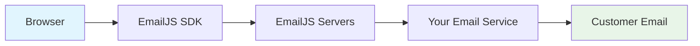

# EmailJS Setup Guide - Send Invoices to Any Email Address

## Overview
EmailJS allows you to send emails directly from the browser without server-side configuration. This means you can send invoices to **any customer email address** without domain verification restrictions.

## ✅ Benefits of EmailJS
- ✅ **No Server Required**: Runs entirely in the browser
- ✅ **Any Email Address**: Send to any customer without restrictions  
- ✅ **Free Tier**: 200 emails/month for free
- ✅ **Easy Setup**: Just JavaScript configuration, no backend changes
- ✅ **Multiple Email Services**: Gmail, Outlook, Yahoo, custom SMTP
- ✅ **Template Based**: Professional HTML email templates

## 🚀 Quick Setup (5 minutes)

### 1. Create EmailJS Account
1. Go to [https://www.emailjs.com](https://www.emailjs.com)
2. Click **"Sign Up"** and create a free account
3. Verify your email address

### 2. Add Email Service
1. In EmailJS dashboard, click **"Email Services"**
2. Click **"Add New Service"** 
3. Choose your email provider (Gmail recommended):
   - **Gmail**: Use your Gmail account
   - **Outlook**: Use your Outlook/Hotmail account  
   - **Yahoo**: Use your Yahoo account
   - **Custom SMTP**: Use any SMTP server
4. Follow the connection wizard
5. **Important**: Note your **Service ID** (e.g., `service_abc123`)

### 3. Create Email Template
1. Click **"Email Templates"** in dashboard
2. Click **"Create New Template"**
3. Use this template content:

**Subject:**
```
Invoice #{{invoice_number}} - {{invoice_total}}
```

**HTML Content:**
```html
<!DOCTYPE html>
<html>
<head>
    <style>
        body { font-family: Arial, sans-serif; line-height: 1.6; color: #333; }
        .header { background: #f8f9fa; padding: 20px; border-radius: 5px; margin-bottom: 20px; }
        .invoice-details { background: #e9ecef; padding: 15px; border-radius: 5px; margin: 20px 0; }
        .total { font-size: 18px; font-weight: bold; color: #007bff; }
        .banking { background: #d4edda; padding: 15px; border-radius: 5px; margin: 20px 0; }
    </style>
</head>
<body>
    <div class="header">
        <h1>Invoice from {{company_name}}</h1>
        <p>Dear {{to_name}},</p>
        <p>Thank you for your business! Please find your invoice details below:</p>
    </div>
    
    <div class="invoice-details">
        <h2>📋 Invoice Details</h2>
        <p><strong>Invoice Number:</strong> #{{invoice_number}}</p>
        <p><strong>Issue Date:</strong> {{issue_date}}</p>
        <p><strong>Due Date:</strong> {{due_date}}</p>
        <p><strong>Payment Terms:</strong> {{payment_terms}}</p>
    </div>
    
    <div class="invoice-details">
        <h2>📦 Items & Services</h2>
        <pre>{{items_list}}</pre>
    </div>
    
    <div class="invoice-details">
        <h2>💰 Summary</h2>
        <p>Subtotal: {{invoice_subtotal}}</p>
        <p>Tax: {{invoice_tax}}</p>
        <p class="total">Total Due: {{invoice_total}}</p>
    </div>
    
    <div class="invoice-details">
        <h2>💳 Payment Options</h2>
        <p>🌐 <a href="{{payment_link}}" style="color: #007bff;">Pay Online (Credit/Debit Card)</a></p>
        {{#banking_details}}
        <div class="banking">
            <pre>{{banking_details}}</pre>
        </div>
        {{/banking_details}}
    </div>
    
    {{#notes}}
    <div class="invoice-details">
        <h2>📝 Notes</h2>
        <p>{{notes}}</p>
    </div>
    {{/notes}}
    
    <p>Questions about this invoice? Reply to this email or contact us directly.</p>
    
    <p>Best regards,<br>{{company_name}}</p>
    
    <hr>
    <small>This invoice was sent via EmailJS Professional Invoice System</small>
</body>
</html>
```

4. **Important**: Note your **Template ID** (e.g., `template_xyz789`)

### 4. Get Your Public Key
1. Go to **"Account"** → **"General"**
2. Find your **Public Key** (e.g., `abc123XYZ`)
3. Keep this safe - you'll need it for configuration

### 5. Configure the App
Edit the file: `frontend/src/utils/emailjs-service.js`

Replace these values:
```javascript
// EmailJS Configuration  
const EMAILJS_SERVICE_ID = 'your_service_id_here';     // From Step 2
const EMAILJS_TEMPLATE_ID = 'your_template_id_here';   // From Step 3  
const EMAILJS_PUBLIC_KEY = 'your_public_key_here';     // From Step 4
```

Example:
```javascript
const EMAILJS_SERVICE_ID = 'service_abc123';
const EMAILJS_TEMPLATE_ID = 'template_xyz789'; 
const EMAILJS_PUBLIC_KEY = 'abc123XYZ';
```

### 6. Test It!
1. Rebuild the app: `npm run build`
2. Deploy: `git add . && git commit -m "Configure EmailJS" && git push`
3. Go to any invoice and click **"Send Invoice"**
4. The email will be sent via EmailJS to any email address! 🎉

## 📧 How It Works


1. **Browser**: User clicks "Send Invoice"
2. **EmailJS SDK**: Formats email with template
3. **EmailJS Servers**: Process and route email
4. **Your Email Service**: Gmail/Outlook sends the email
5. **Customer**: Receives professional invoice email

## ✅ Success!

Once configured, your invoice app will:
- ✅ Send emails to **any customer address**
- ✅ Use professional HTML templates  
- ✅ Work without server configuration
- ✅ Track email delivery status
- ✅ Bypass domain verification restrictions

**No more "Testing mode restriction" errors!** 🎉

## 💰 Pricing
- **Free**: 200 emails/month
- **Personal ($15/month)**: 1,000 emails/month  
- **Business ($30/month)**: 3,000 emails/month

## 🔧 Configuration Priority
The app will use email services in this order:
1. **EmailJS** (if configured) - Send to any address
2. **Gmail SMTP** (if configured) - Unlimited emails  
3. **Resend** (fallback) - Requires domain verification

Configure EmailJS to unlock unrestricted email sending! 🚀📧